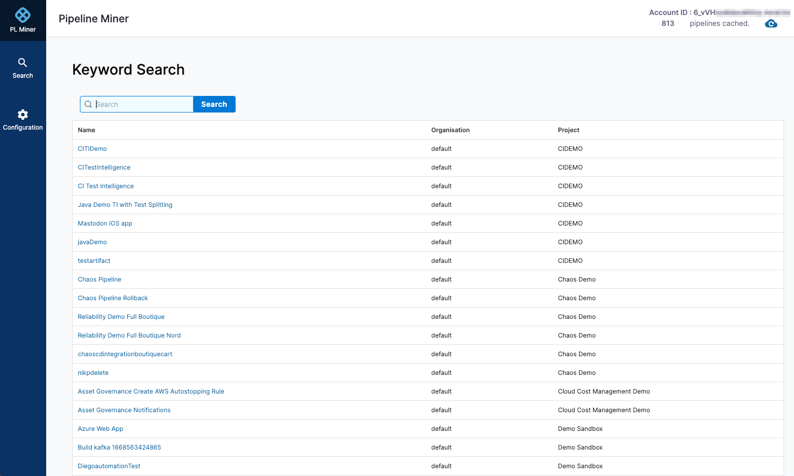
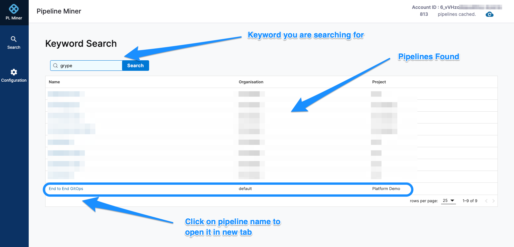
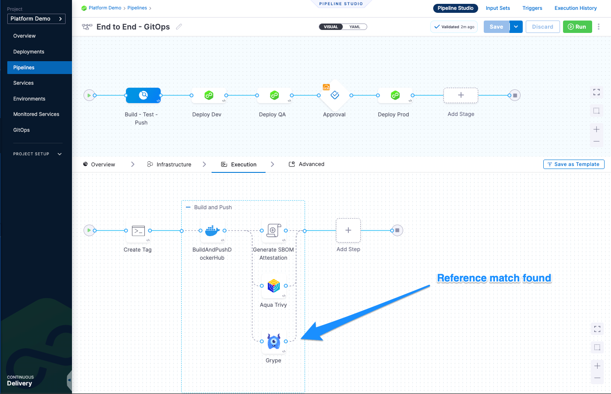
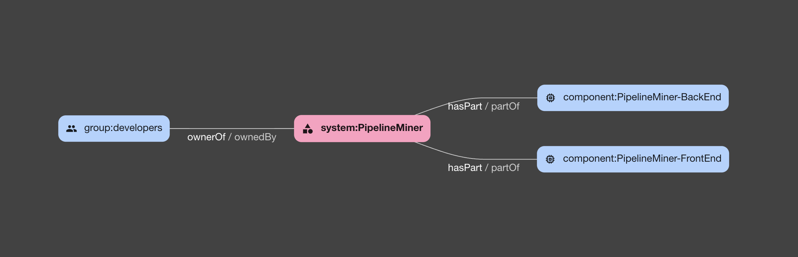

# Pipeline Miner



## Description
Pipeline Miner is a powerful tool designed for searching through Harness pipelines using keywords. It serves as the 'grep' for Harness pipelines, allowing users to efficiently locate and reference pipelines within an account. It made my onboarding with Harness that much 'smoother', and I am actually using it regularly on a day-to-day basis to help me discover the wonder things my colleagues are doing with Harness. ;)

## Purpose
The primary function of this Docker image is to facilitate the search and identification of specific build steps or components within Harness pipelines. For instance, users can quickly find a pipeline utilizing tools like 'Sonarqube', which is particularly useful for referencing and replicating configurations.

## Key Features
- **Keyword Search:** Seamlessly search through Harness pipelines using keywords to find specific build steps or configurations.
- **Direct Navigation:** Provides the ability to click on a pipeline name to open the actual pipeline in Harness in a new tab, enhancing user experience and workflow efficiency.
- **Use Case Oriented:** Ideal for locating pipelines with specific tools or configurations, like 'Sonarqube', to serve as a reference or template.

## Requirements
- Docker installed on your machine.
- An active Harness account.
- A Service Account Token for secure access.

## Usage Instructions
1. Run the following docker command from the command line:
```
    docker run -p 1337:1337 iamlennym/pipeline-miner:latest
```
2. Connect to http://localhost:1337 with your browser.
3. Follow the on-screen instructions to input your Harness account ID and the service account token. Once you click submit, PipelineMiner will contact the Harness manager and retrieve pipeline information to be cached.
4. Once done you will be able to perform keyword searches across pipelines within the account.

In this example we searched for the word *grype* and was presented with a couple of matches:


By clicking on the pipeline name, we can easily access the pipeline within Harness:


## Contact Information
For support, feedback, or any queries, feel free to contact Leendert Meyer at iamlennym@gmail.com.

## NOTE:
- This repo only contains the Dockerfile etc to build the docker image for the Pipeline Miner
- It references 2 seperate private repositories (plminer and plminer-be)
- Access to these repos can be requested (iamlennym@gmail.com)

The following illustrates the dependencies:

